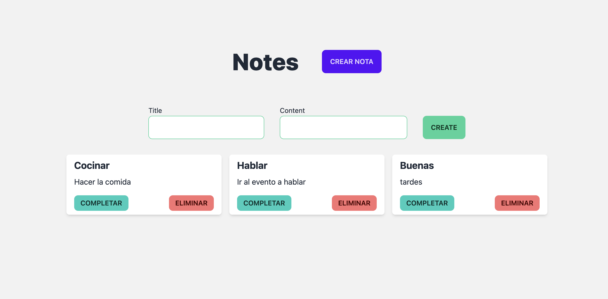

# Fast note ⚡️

An app to show tRPC powers

## Used

- React
- NextJs
- tRPC
- Typescript
- Tailwind
- Daisy Ui

## Preview



## Getting Started

1. Install dependencies

2. Prepare the local database

```bash
npx prisma generate
npx prisma db push
```

3. Run the development server:

```bash
npm run dev
# or
yarn dev
# or
pnpm dev
```

Open [http://localhost:3000](http://localhost:3000) with your browser to see the result.
